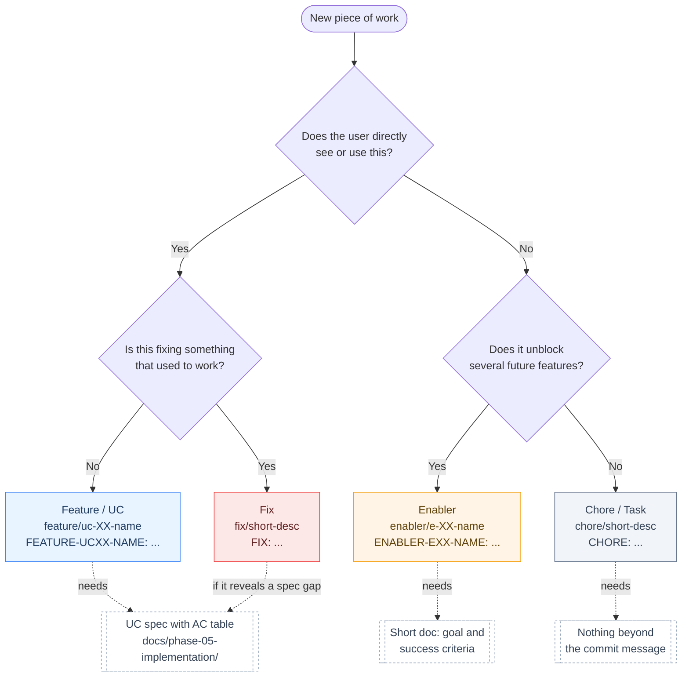
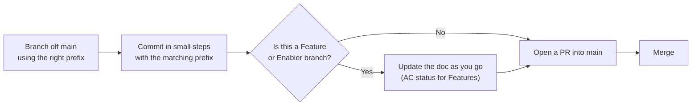

# Contributing

## Types of Work

Not every change is a "feature." This project sorts work into four types. Each type has its own rules for docs, branch names, and commit messages.

| Type | What it means | Needs a doc? | Branch name | Commit prefix |
|---|---|---|---|---|
| Feature / UC | The user can now do something new | Yes, full UC spec with an AC table | `feature/uc-XX-name` | `FEATURE-UCXX-NAME: [Session/Stage, AC-refs]` |
| Enabler | Sets up something future features will need | Yes, short doc with goal and success criteria | `enabler/e-XX-name` | `ENABLER-EXX-NAME: [Stage] ...` |
| Chore / Task | Small cleanup or upkeep | No, the commit message is enough | `chore/short-desc` | `CHORE: ...` |
| Fix | Something that used to work is now broken | No, unless it reveals a gap in the spec | `fix/short-desc` | `FIX: ...` |

### What each type means

**Feature / UC**: Work that gives the user something new to do, like creating a note, viewing a note, or searching notes. Every feature links back to a Functional Requirement (FR) in `docs/phase-01-requirements/p01-01-requirements.md`. It gets its own UC spec with an Acceptance Criteria (AC) table. We trace it end to end: FR, then UC, then AC, then Test, then Code, then Commit.

**Enabler**: Setup or infrastructure work that makes future features possible, but that no user asks for by name. Examples: setting up the Next.js app, building the API client layer, configuring the database engine, setting up CI. Ask yourself: if this is skipped, do several future features get blocked? If yes, it's an Enabler and deserves a short doc. If it only touches one small spot, it's a Chore instead.

**Chore / Task**: Small, standalone upkeep. Bumping a dependency, tweaking a lint rule, renaming a file, updating `.gitignore`. Nothing else is waiting on it. No doc needed, just a clear commit message.

**Fix**: Something that used to work and now doesn't. This differs from a Feature because it doesn't add new capability, it restores or corrects something that already existed. If a fix reveals that the original spec was wrong or missing something, update the UC doc's AC table instead of quietly patching around it.

> A real example from this project: the first commits (`4b761b6 FEATURE-SETUP: Setup the project with backend`) called the initial scaffolding a Feature. Looking back, that was really an Enabler, since nobody could "use" a bare project skeleton. That's the exact mix-up this guide is meant to prevent going forward.

---

## How to Classify New Work

---

## Branch and PR Workflow

A few notes on this flow:

1. Branch off `main` using the prefix from the table above.
2. Commit in small, reviewable steps using the matching commit prefix. Reference AC IDs for Feature work (for example `[S3, AC-01..06, AC-12]`), and Stage numbers for Enabler work (for example `[Stage 1]`).
3. For Feature branches, update the UC doc's AC status column as work lands (Planned, then In Progress, then Verified).
4. Open a PR into `main`. A Chore can often be a single commit. Features and Enablers usually land as a sequence of commits merged through one PR, as you can see in the existing history.
5. Docs land in the same PR as the code they describe. Don't leave documentation for a follow-up PR.

## Where Things Live

- `docs/phase-01-requirements/`: the FRs, NFRs, and the list of use cases. This rarely changes, only when scope changes.
- `docs/phase-05-implementation/`: one spec per UC (Feature work), and going forward, one short doc per Enabler.
- Commit history: the record of Chores and Fixes. No separate doc needed.
